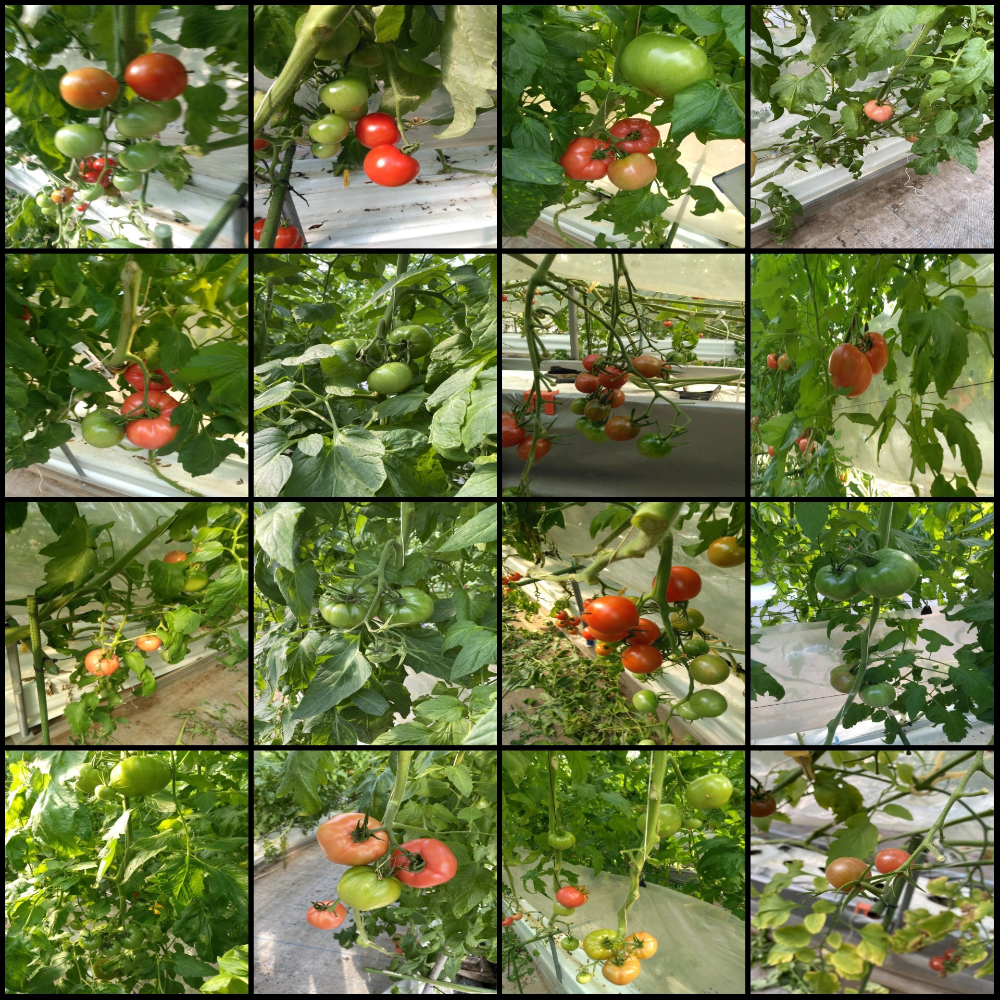
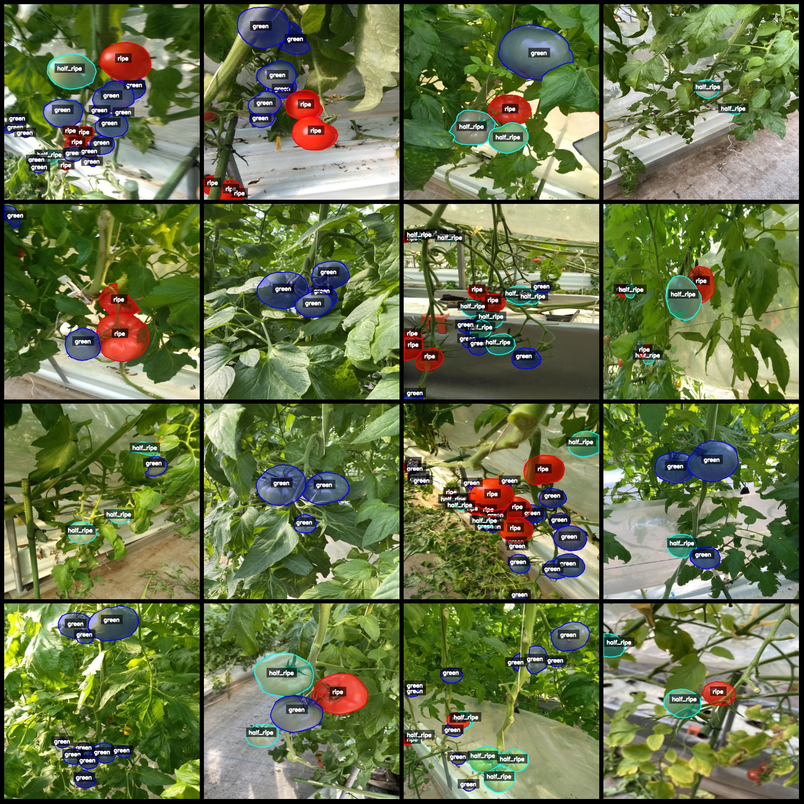
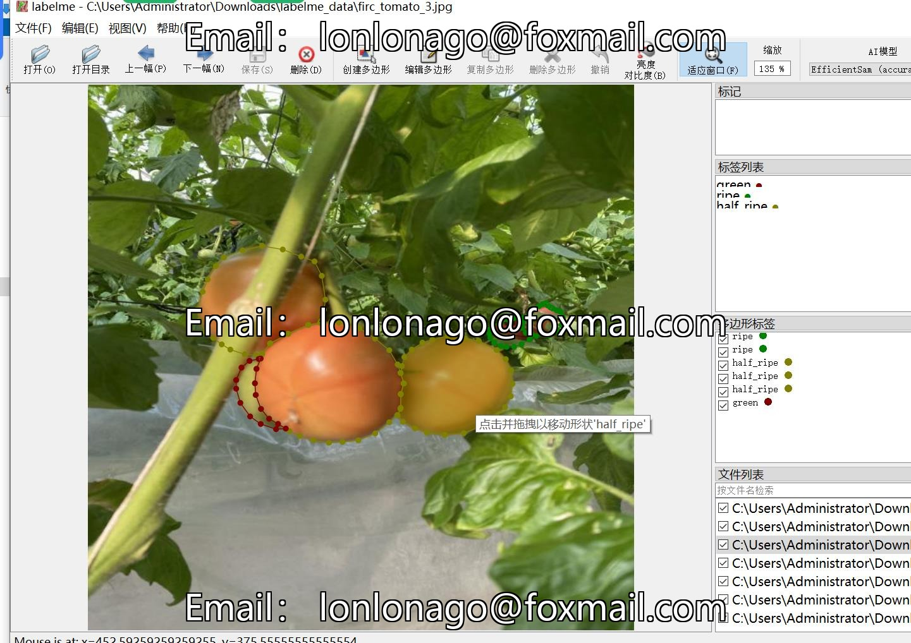

# Tomato  ripeness identification and segmentation dataset in labelme format, with 783 images in 3 categories

Dataset format: labelme format (without mask files, only containing jpg images and corresponding json files)  
Number of images (number of jpg files): 783  
Number of annotations (json file count): 783  
Number of annotation categories: 3  
Annotation category names: ["green", "ripe", "half_ripe"]  
Number of boxes for each category:  
green count = 6211  
ripe count = 1605  
half_ripe count = 1591  
Total box count: 9407  
Labelme tool used: labelme=5.5.0  
Image resolution: 640x640  
Annotation rules: draw polygons for categories  
Important note: The dataset can be edited using labelme, but the json dataset needs to be converted into either mask or yolo format for instance segmentation or semantic segmentation.  
Special declaration: This dataset does not guarantee the accuracy of the trained model or weight files.  
Image preview:  
Annotation example:  
Randomly selected 16 images:  
Annotation drawing result:  
Labelme editing image example:

## Images

Here is a pay link on Stripe ( https://buy.stripe.com/3cs8yP7sY87d0vu9AB ). Please contact me lonlonago@foxmail.com after funding $89, and I will send you a complete data files , thank you!

